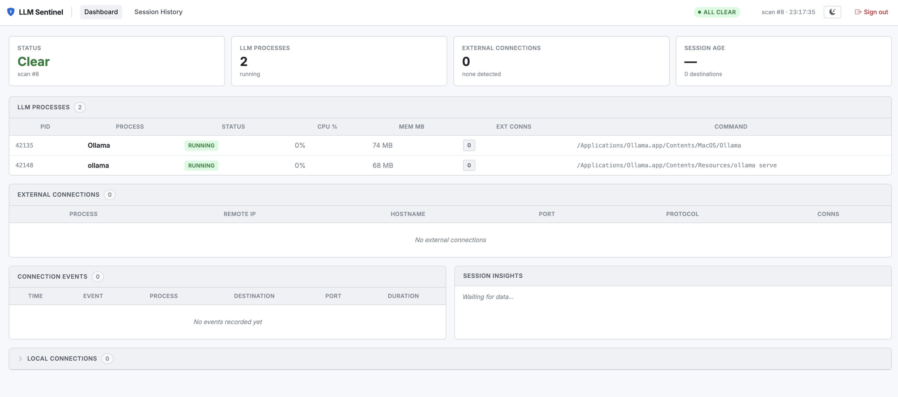
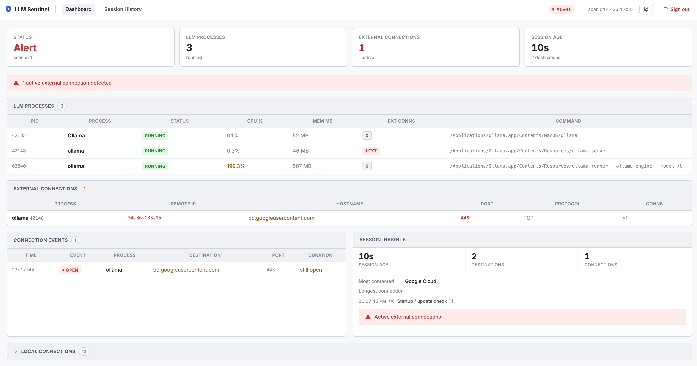

# LLM Sentinel

A lightweight, cross-platform tool that monitors locally-running LLM processes for unexpected external network connections — giving you visibility into when your AI models are "phoning home".

## Why

Local LLMs are increasingly complex stacks: inference servers, frontends, Python wrappers, Electron apps. Any of these could make network calls you didn't authorise — model downloads, telemetry, exfiltration. LLM Sentinel watches every connection those processes make and alerts you in real time.

## Features

- **Reliable process detection** — multi-signal scoring catches LLM runtimes regardless of what name the process uses:
  - Open model weight files (`.gguf`, `.safetensors`, `.ggml`, …)
  - ML inference libraries in memory (`libcublas`, `libtorch`, `libonnxruntime`, … on Linux)
  - Known name / cmdline patterns (Ollama, vLLM, LM Studio, Open WebUI, Aider, …)
  - Large memory footprint as a supporting signal
- **External connection alerting** — classifies connections as local (safe) or external (flagged), with reverse DNS resolution and known-org labelling (AWS, GCP, Cloudflare, HuggingFace, …)
- **Live terminal dashboard** — `rich`-powered TUI with per-scan tables
- **Web dashboard** — FastAPI + enterprise-style UI with dark/light theme
  - Metric tiles, live process & connection tables
  - Session history — browse every past run, expand to see the full connection event log
  - Secure login (scrypt-hashed passwords, 8-hour session tokens, httponly cookies)
- **Session persistence** — SQLite stores the full connection history across restarts
- **Insights panel** — session age, unique destinations, most-contacted host, connection phases
- **Zero external auth dependencies** — password hashing via Python's built-in `hashlib.scrypt`

## Supported tools

Detected by name/cmdline pattern, or by the model files and libraries they load:

| Tool | Detection method |
|---|---|
| Ollama | name pattern |
| LM Studio | name pattern |
| llama.cpp / llama-server | name pattern |
| llamafile | name pattern + `.gguf` file open |
| vLLM | cmdline (`vllm.entrypoints`) |
| Open WebUI | cmdline (`open_webui`) |
| KoboldCPP | name pattern |
| LocalAI | name pattern |
| text-generation-webui (oobabooga) | name / cmdline pattern |
| GPT4All | name pattern |
| ComfyUI / Automatic1111 | name pattern |
| Aider | cmdline pattern |
| Open Interpreter | cmdline (`-m interpreter`) |
| AnythingLLM | cmdline pattern |
| InvokeAI | cmdline pattern |
| HuggingFace TGI | cmdline pattern |
| TabbyML | name / cmdline pattern |
| MLC LLM, TorchServe, Triton | name pattern |
| **Any renamed binary** | `.gguf` / `.safetensors` file open |
| **Any Python wrapper** | ML libs in memory (Linux) |

## Requirements

- Python 3.11+
- Linux, macOS, or Windows

```bash
pip install -r requirements.txt
```

```
psutil>=5.9.0
rich>=13.0.0
fastapi>=0.110.0
uvicorn[standard]>=0.29.0
python-multipart>=0.0.9
```

## Quickstart

### Terminal dashboard (default)

```bash
python main.py
```

### Terminal dashboard + web UI

```bash
python main.py --web
# Web dashboard → http://localhost:7777
# Password is printed on first run
```

### Set your own web password

```bash
python main.py --web --web-password mysecretpassword
```

### Headless / scripting mode

```bash
python main.py --no-dashboard
python main.py --no-dashboard --count 5        # run 5 scans then exit
python main.py --no-dashboard --log alerts.log
```

### All options

```
--interval / -i   Scan interval in seconds (default: 3)
--no-dashboard    Print to stdout instead of live TUI
--log FILE        Append connection alerts to a file
--count / -n      Run N scans then exit
--web             Also start web dashboard
--web-port PORT   Web dashboard port (default: 7777)
--web-password    Set the admin password for the web dashboard
```

## Architecture

```
main.py
 ├── process_monitor.py   Multi-signal LLM process detection
 ├── network_monitor.py   Connection classification (local vs. external)
 ├── resolver.py          Async reverse DNS + known-org labelling
 ├── session_log.py       SQLite persistence (connections, events, sessions)
 ├── alerts.py            Alert deduplication and optional file logging
 ├── dashboard.py         Rich terminal UI
 └── web.py               FastAPI web dashboard + auth middleware
      └── auth.py         scrypt password hashing, session token management
```

### Process detection scoring

A process is included when its **total score ≥ 2**:

| Signal | Score | Notes |
|---|---|---|
| Open model weight file | +3 | `.gguf`, `.safetensors`, `.ggml`, `.q4_0`, … |
| ML library in memory | +2 | `libcublas`, `libtorch`, `libonnxruntime`, … (Linux) |
| Known name / cmdline pattern | +2 | Ollama, vLLM, Open WebUI, Aider, etc. |
| RSS > 2 GB | +1 | Supporting signal only — not sufficient alone |

A Spring Boot app on port 8000 scores 0 and is never shown.
A binary renamed to `worker` but with a 4 GB `.gguf` file open scores 3 and is detected.
`python3 -m vllm.entrypoints.openai.api_server` scores 2 from the cmdline pattern alone.

### Connection classification

Connections are **local** (safe) if they go to:
- Loopback (`127.x.x.x`, `::1`)
- Private networks (`10.x`, `172.16–31.x`, `192.168.x`)
- Link-local (`169.254.x`)

All other connections are **external** and trigger an alert.

## Web dashboard

Start with `--web`. On first run a random admin password is generated and printed:

```
Web auth: no users found — created admin account
Web password: xK9mPqR2sLtN
(change with --web-password YOUR_PASSWORD)
Web dashboard → http://127.0.0.1:7777
```

The dashboard auto-refreshes every 3 seconds. Use **Session History** to browse past runs and expand individual sessions to see the full connection event log.


## Screenshots
- See `docs/screenshots/` for dashboard and alert images
- 
- 
- 

## Running tests
```bash
pip install pytest httpx
pytest tests/
```

306 tests covering process detection, network classification, session logging, authentication, and web endpoints.

## Platform support

| Feature | Linux | macOS | Windows |
|---|---|---|---|
| Process name / cmdline detection | ✓ | ✓ | ✓ |
| Open model file detection | ✓ | ✓ | ✓ |
| ML library in memory detection | ✓ | — | — |
| Network connection monitoring | ✓ | ✓ | ✓ |
| Terminal dashboard | ✓ | ✓ | ✓ |
| Web dashboard | ✓ | ✓ | ✓ |

The ML library signal uses `psutil.memory_maps()` which is supported on Linux but not macOS (psutil 7.x) or Windows. All other signals work on every platform. The code never crashes on unsupported platforms — signals that can't be collected are silently skipped.

## License

MIT
